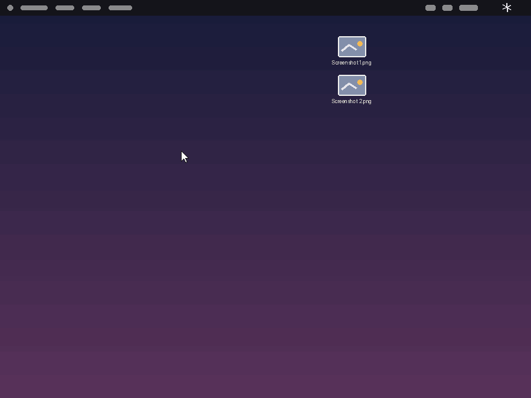

[English](README.md) | [한국어](README.ko.md) | [日本語](README.ja.md) | [简体中文](README.zh-Hans.md)

<p align="center">
  
</p>

<h1 align="center">macssential</h1>

<p align="center"><em>Take control of macOS defaults — right from your menu bar.</em></p>

<p align="center">
  <a href="https://github.com/LuxuryCarrot/macssential/releases"></a>
  <a href="LICENSE"></a>
  
  
  <a href="https://ko-fi.com/luxurycarrot"></a>
</p>

macssential is a menu bar utility for macOS 14+ that lets you take control of
inconvenient macOS defaults with a single click — dock behavior across
monitors, keyboard repeat speed, scroll direction, filename normalization, and
more. Each feature is an independent module you can switch on or off right
from the menu bar, with no digging through System Settings.

<p align="center"></p>

> macssential is open source under the [MIT License](LICENSE).

## Features

- **Dock Anchor** — Lock the Dock to a specific monitor so it stops jumping
  between displays.
- **Dock Auto-Hide** — Automatically hide and show the Dock.
- **Hide Recent Apps** — Remove the recently used apps section from the Dock.
- **Hidden Files** — Show hidden files in Finder.
- **Key Repeat** — Faster keyboard repeat than System Settings allows.
- **Scroll Direction** — Set mouse and trackpad scrolling directions
  independently.
- **Screenshot Auto-Copy** — Copy screenshots straight to the clipboard
  instead of saving files to the Desktop.
- **Filename Normalizer** — Automatically rename decomposed (NFD) filenames
  to NFC, fixing garbled-looking names for Korean, Japanese, and other
  languages.
- **Window Switcher** — Windows-style Cmd+Tab that switches between
  individual windows instead of apps: a thumbnail grid you can drive with
  Tab, arrow keys, or the mouse. Window previews light up when Screen
  Recording permission is granted (app icons otherwise).


## Feature Demos

<details><summary><b>Dock Anchor</b></summary>
<p align="center"></p>
</details>
<details><summary><b>Dock Auto-Hide</b></summary>
<p align="center"></p>
</details>
<details><summary><b>Hide Recent Apps</b></summary>
<p align="center"></p>
</details>
<details><summary><b>Hidden Files</b></summary>
<p align="center"></p>
</details>
<details><summary><b>Key Repeat</b></summary>
<p align="center"></p>
</details>
<details><summary><b>Scroll Direction</b></summary>
<p align="center"></p>
</details>
<details><summary><b>Screenshot Auto-Copy</b></summary>
<p align="center"></p>
</details>
<details><summary><b>Customize Screenshot Save Path</b></summary>
<p align="center"></p>
<p>Pick any folder right from the panel (“Also save to folder” → Choose…). This works only while macssential is running and never modifies macOS system settings — quit or remove the app and screenshots instantly return to the stock Desktop behavior.</p>
</details>
<details><summary><b>Filename Normalizer</b></summary>
<p align="center"></p>
</details>

## Using the App

**Menu bar panel.** Click the ✱ icon in the menu bar to open the dropdown
panel. Toggle features on or off with a click — enabled modules show their
controls (sliders, options) right inside the panel.

**Settings window.** Click the Settings (gear) button at the bottom of the
panel to open the Settings window. It has four tabs: General, Modules, Panel,
and About. The Modules tab enables or disables modules app-wide.

**Customizing the panel.** Use the Panel tab to choose exactly which modules
appear in the menu bar panel, so it only shows what you actually use.


<p align="center"></p>

## Install

### Homebrew

```sh
brew tap luxurycarrot/tap
brew install macssential
```

(One-time `brew tap` registers the tap; recent Homebrew versions may ask you
to confirm trusting it. After that, `brew install macssential` and
`brew upgrade macssential` work with the short name.)

Or as a one-liner:

```sh
brew install --cask luxurycarrot/tap/macssential
```

### Direct download

1. Download the latest DMG from the
   [Releases page](https://github.com/LuxuryCarrot/macssential/releases).
2. Open the DMG and drag `macssential.app` into your `Applications` folder.
3. Launch macssential — it appears in your menu bar.

## Updates

macssential updates itself automatically via
[Sparkle](https://sparkle-project.org/). The app checks the update feed at
`https://luxurycarrot.github.io/macssential/appcast.xml` and offers
new versions in-app — no manual downloads needed.

## Permissions

Dock Anchor, Scroll Direction, Screenshot Auto-Copy, and Window Switcher
require the Accessibility permission. Window Switcher can additionally use
the Screen Recording permission (optional) to show window previews. Grant it in **System Settings > Privacy & Security >
Accessibility** — the app will guide you there when needed. The other modules
work without any special permissions.

> **Note:** While another app holds macOS **Secure Keyboard Input** (e.g.
> Terminal showing a password prompt or a full-screen terminal UI), macOS
> blocks keyboard interception for every app system-wide, so Screenshot
> Auto-Copy temporarily falls back to the native screenshot behavior.
> macssential detects this, shows a warning naming the app holding the lock,
> and resumes automatically once it is released.

## Requirements

- macOS 14 Sonoma or later

## Feedback

Found a bug or have a feature idea? Open a
[bug report or feature request](https://github.com/LuxuryCarrot/macssential/issues/new/choose)
on the Issues page. For questions and open-ended ideas, join the conversation
in [Discussions](https://github.com/LuxuryCarrot/macssential/discussions).

Want to influence the roadmap? Vote on the next feature in the [Feature Voting thread](https://github.com/LuxuryCarrot/macssential/discussions/1).

## Support

macssential is free and open source. If it makes your Mac life easier,
you can support development with a coffee on
[Ko-fi](https://ko-fi.com/luxurycarrot). ☕

Tips go directly toward keeping the Apple Developer membership active — the code signing and notarization that let macssential run without security warnings.

<p align="center">
  <a href="https://ko-fi.com/luxurycarrot"></a>
</p>


---

<sub>macssential is an independent open-source project and is not affiliated with, endorsed by, or sponsored by Apple Inc. Mac and macOS are trademarks of Apple Inc.</sub>
