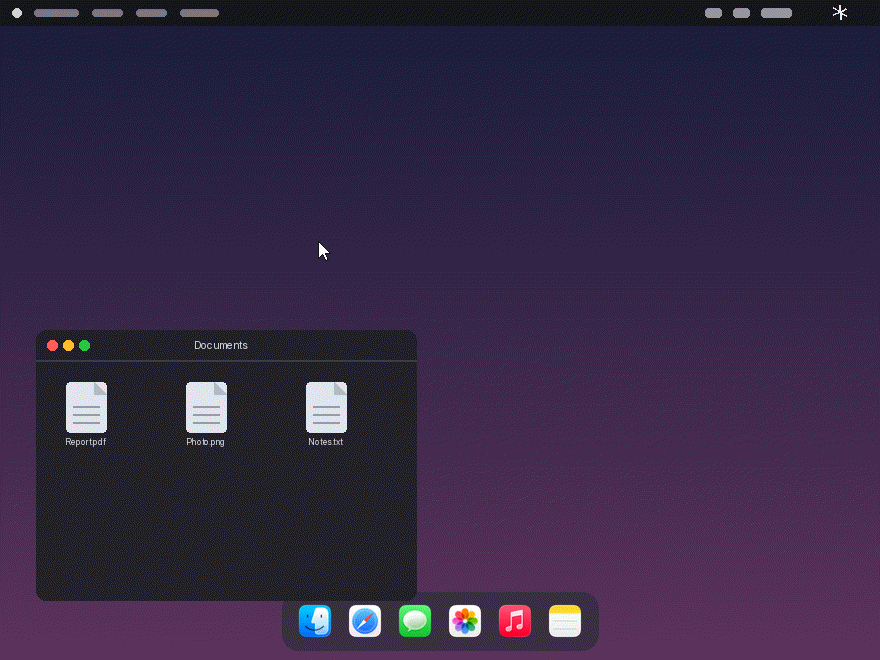
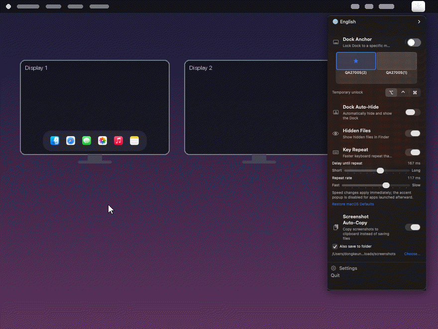
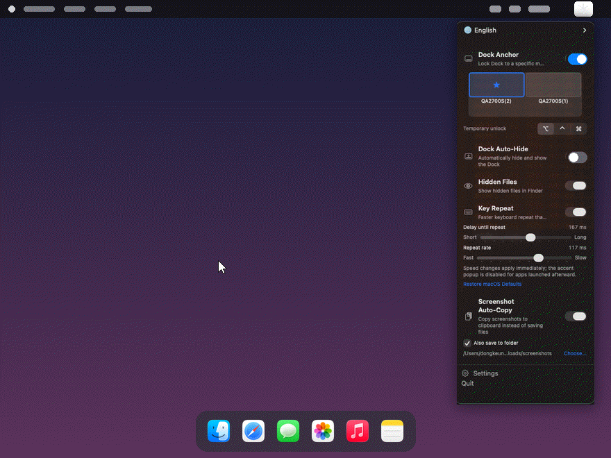
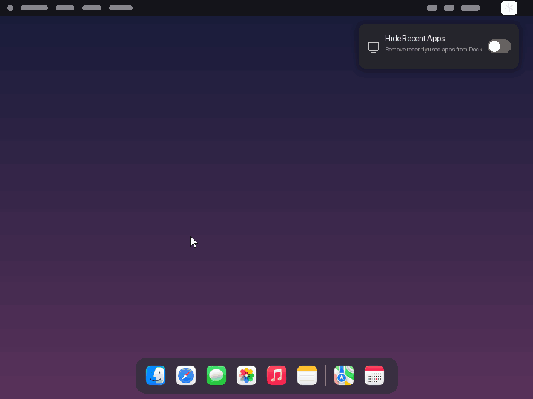
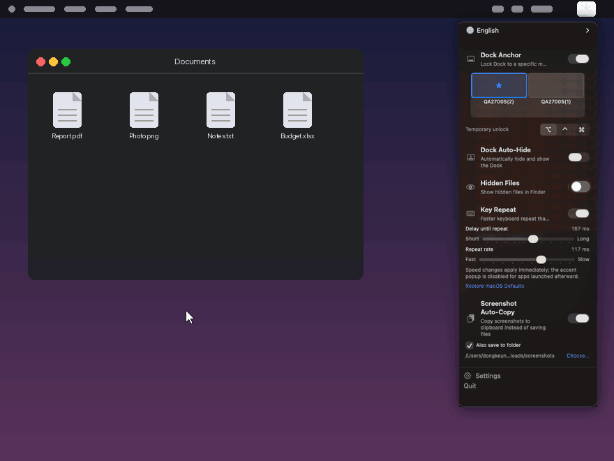
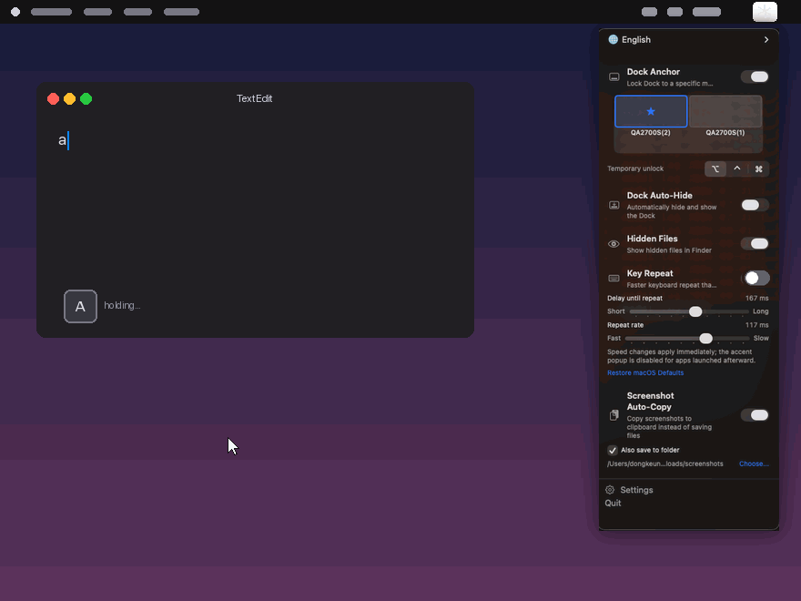
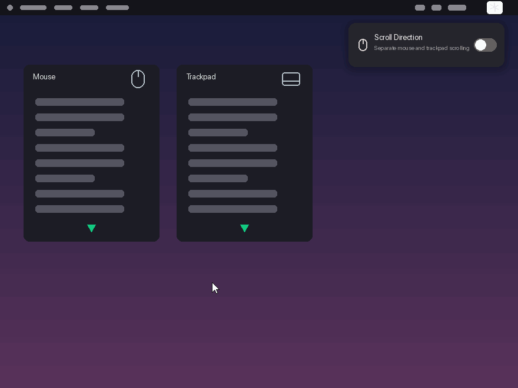
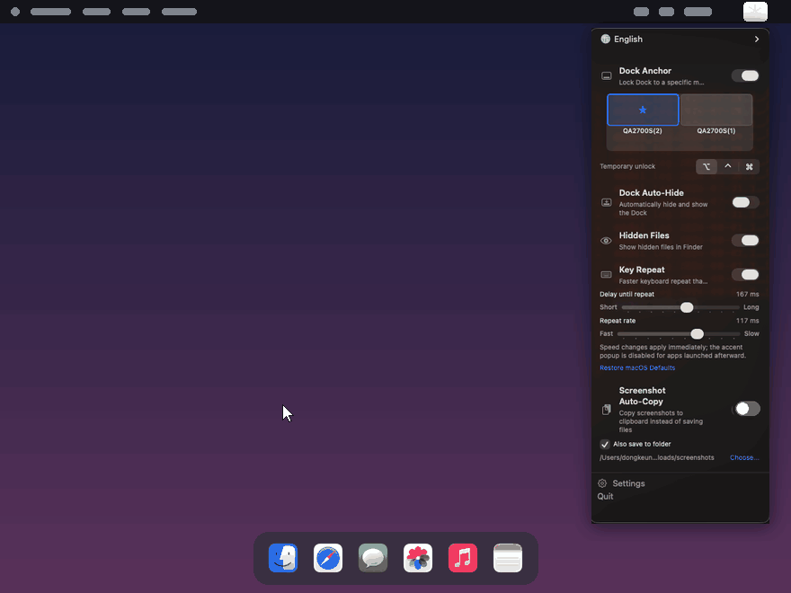
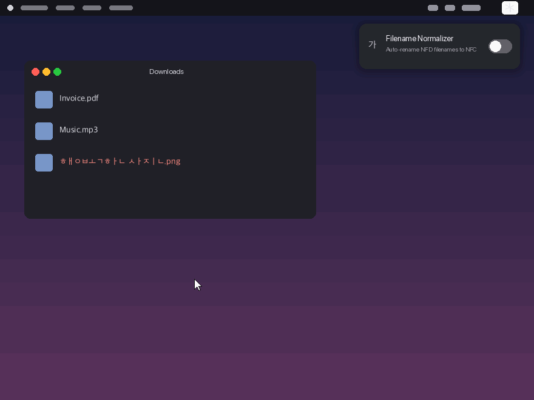
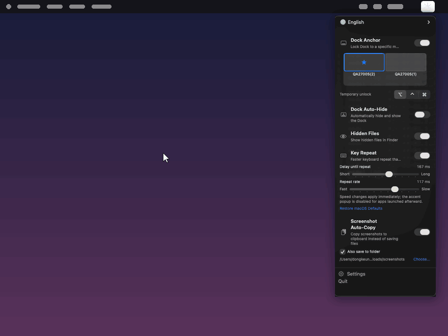

[English](README.md) | [한국어](README.ko.md) | [日本語](README.ja.md) | [简体中文](README.zh-Hans.md)

<p align="center">
  
</p>

<h1 align="center">macssential</h1>

<p align="center"><em>在菜单栏中掌控 macOS 的默认行为。</em></p>

<p align="center">
  <a href="https://github.com/LuxuryCarrot/macssential/releases"></a>
  <a href="LICENSE"></a>
  
  
  <a href="https://ko-fi.com/luxurycarrot"></a>
</p>

macssential 是一款面向 macOS 14+ 的菜单栏实用工具，让你只需一次点击就能掌控
macOS 那些不方便的默认行为——程序坞在多显示器间的移动、按键重复速度、滚动方向、
文件名规范化等等。每个功能都是独立模块，无需在系统设置里翻找，直接在菜单栏中
即可开关。

<p align="center"></p>

> macssential 基于 [MIT 许可证](LICENSE)开源。

## 功能

- **程序坞锚定** — 将程序坞固定在指定显示器上，不再在屏幕之间来回跳动。
- **程序坞自动隐藏** — 自动隐藏和显示程序坞。
- **隐藏最近使用的 App** — 从程序坞中移除"最近使用的 App"区域。
- **隐藏文件** — 在访达中显示隐藏文件。
- **按键重复** — 突破系统设置的上限，获得更快的按键重复速度。
- **滚动方向** — 分别设置鼠标和触控板的滚动方向。
- **截图自动拷贝** — 将截图直接拷贝到剪贴板，而不是存储为文件。
- **文件名规范化** — 自动将分解形式（NFD）的文件名重命名为 NFC，修复韩文、
  日文等语言中看起来乱码的文件名。


## 功能演示

<details><summary><b>程序坞锚定</b></summary>
<p align="center"></p>
</details>
<details><summary><b>程序坞自动隐藏</b></summary>
<p align="center"></p>
</details>
<details><summary><b>隐藏最近使用的 App</b></summary>
<p align="center"></p>
</details>
<details><summary><b>隐藏文件</b></summary>
<p align="center"></p>
</details>
<details><summary><b>按键重复</b></summary>
<p align="center"></p>
</details>
<details><summary><b>滚动方向</b></summary>
<p align="center"></p>
</details>
<details><summary><b>截图自动拷贝</b></summary>
<p align="center"></p>
</details>
<details><summary><b>文件名规范化</b></summary>
<p align="center"></p>
</details>

## 使用方法

**菜单栏面板。** 点击菜单栏中的 ✱ 图标即可打开下拉面板。一键开关各项功能，
已启用的模块会直接在面板内显示滑块、选项等控制项。

**设置窗口。** 点击面板底部的设置（齿轮）按钮打开设置窗口，其中包含四个标签页：
通用 / 模块 / 面板 / 关于。在"模块"标签页中可以在整个 App 范围内启用或停用
各模块。

**自定义面板。** 在"面板"标签页中可以自由选择哪些模块显示在菜单栏面板里，
只保留你真正常用的功能。


<p align="center"></p>

## 安装

### Homebrew

```sh
brew tap luxurycarrot/tap
brew install macssential
```

（`brew tap` 只需执行一次；较新版本的 Homebrew 可能会要求你确认信任该 tap。
之后即可使用短名称执行 `brew install macssential` 和
`brew upgrade macssential`。）

也可以一行命令安装:

```sh
brew install --cask luxurycarrot/tap/macssential
```

### 直接下载

1. 从 [Releases 页面](https://github.com/LuxuryCarrot/macssential/releases)
   下载最新的 DMG。
2. 打开 DMG，将 `macssential.app` 拖入"应用程序"文件夹。
3. 启动 macssential，它会出现在菜单栏中。

## 更新

macssential 通过 [Sparkle](https://sparkle-project.org/) 自动更新。App 会检查
`https://luxurycarrot.github.io/macssential/appcast.xml` 更新源，并在
App 内提示新版本——无需手动下载。

## 权限

程序坞锚定、滚动方向和截图自动拷贝这三个模块需要辅助功能权限。请在
**系统设置 > 隐私与安全性 > 辅助功能** 中授予权限——需要时 App 会引导你前往。
其余模块无需任何特殊权限即可工作。

## 系统要求

- macOS 14 Sonoma 或更高版本

## 反馈

发现问题或有功能想法？请在
[Issues](https://github.com/LuxuryCarrot/macssential/issues/new/choose)
提交错误报告或功能请求。如有疑问或想交流想法，欢迎前往
[Discussions](https://github.com/LuxuryCarrot/macssential/discussions)。

## 支持

macssential 是免费的开源项目。如果它让你的 Mac 使用体验更加轻松，
欢迎在 [Ko-fi](https://ko-fi.com/luxurycarrot) 上请开发者喝杯咖啡，
支持项目开发。☕

---

<sub>macssential 是一个独立的开源项目，与 Apple Inc. 无任何隶属、认可或赞助关系。Mac 和 macOS 是 Apple Inc. 的商标。</sub>
